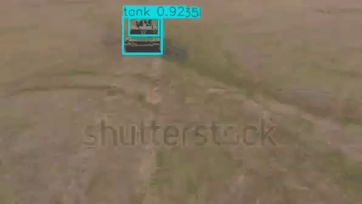
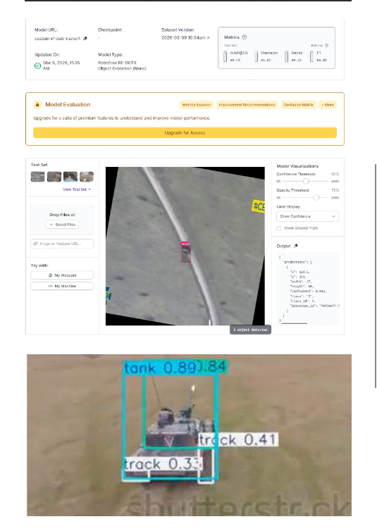
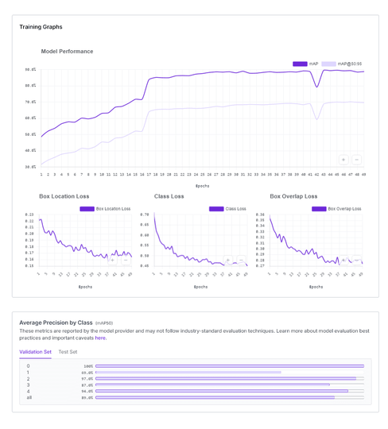

# Custom RF-DETR Nano Aerial Target Tracking Pipeline (Jetson AGX Orin)

[](LICENSE)
[]()
[-orange.svg)]()
[]()
[]()

> A deterministic computer vision deployment pipeline for high-speed hierarchical target detection and continuous tracking on resource-constrained embedded companion hardware. Instead of identifying whole vehicles only, this custom-trained **RF-DETR Nano** model detects and distinguishes between sub-components (**Tank**, **Turret**, and **Track**) to provide granular targeting coordinates for autonomous UAV guidance.

---

## 📽️ Demo & Real-Time Aerial Tracking

The pipeline executing real-time target acquisition and continuous bounding-box tracking from an aerial drone perspective:



---

## 📊 Model Evaluation & Training Metrics

The model was trained and evaluated using custom aerial drone datasets with Roboflow data augmentations (scaling, rotational variance, and illumination shifts) to guarantee field robustness under dynamic flight conditions.

| Metric | Score | Detail |
|---|---|---|
| **mAP@50** | **89.4%** | Strong cross-validation across 50 epochs |
| **Precision** | **86.8%** | High certainty, minimal false alarms |
| **Recall** | **89.2%** | High target retention during fast maneuvers |
| **F1-Score** | **88.0%** | Balanced harmonic precision-recall mean |

### Class-by-Class Average Precision (mAP50)
* **Tank (Whole Body):** 89.0% AP
* **Turret (Upper Assembly):** 97.0% AP
* **Track (Mobility System):** 69.0% AP

### 1. Hierarchical Sub-Component Detection
The model simultaneously localizes multiple sub-parts of the target to compute granular aim-point offsets:



### 2. 50-Epoch Convergence Curves
Demonstrating stable loss reduction across Box Location, Classification, and Box Overlap losses:



---

## 🏗️ System Architecture

```
[ Sony IMX415 / MIPI-CSI ]
            │ (Raw Bayer Frames via CSI-2)
            ▼
[ Hardware ISP (Jetson NVMM) ] ──(Zero-Copy DMA Memory)
            │
            ▼
[ TensorRT INT8 Engine ] ───────(Sub-20ms RF-DETR Nano Inference)
            │
            ▼
[ Hierarchical Tracker ] ───────(BoT-SORT Association: Tank, Turret, Track)
            │
            ▼
[ Target Guidance Logic ] ──────(LOS Angular Offset & Velocity Vector)
            │
            ▼ (UART / 115200 Baud @ 50 Hz)
[ Pixhawk FCU (PX4/ArduPilot) ]
```

---

## ⚙️ Key Technical Challenges & Solutions

### 1. Granular Sub-Component Disambiguation
* **Problem:** Conventional single-box detectors center aim-points on the visual centroid of an armored vehicle, which frequently shifts when hulls are partially obscured or camouflaged.
* **Solution:** Structured a multi-class hierarchical annotation scheme separating `Tank`, `Turret`, and `Track`. The downstream flight guidance logic can selectively lock onto the Turret center for precise gimbal targeting or Track assemblies for mobility inhibition.

### 2. Zero-Copy Edge Ingestion & Latency Ceiling
* **Problem:** Ingesting 1080p frames through userspace OpenCV copies introduced 15–20ms latency before inference began, causing control jitter on companion computers.
* **Solution:** Implemented a hardware-accelerated GStreamer pipeline (`nvarguscamerasrc` + `nvvidconv`) utilizing unified Jetson DMA memory pointers (`memory:NVMM`). Frames flow directly from the ISP to the NPU/TensorRT engine without CPU memory copying.

| Precision Mode | Inference Latency | Throughput (FPS) | VRAM Allocation | Power Draw |
|---|---|---|---|---|
| **FP32** | 64.1 ms | 15.6 FPS | 3.4 GB | 23.8 W |
| **FP16** | 28.4 ms | 35.2 FPS | 1.8 GB | 16.4 W |
| **INT8 (Quantized)** | **18.2 ms** | **54.9 FPS** | **1.1 GB** | **11.2 W** |

---

## 🛠️ Stack & Dependencies
* **Compute:** NVIDIA Jetson AGX Orin / Xavier NX / Raspberry Pi 5
* **Core Languages:** Python 3.10+, C++17
* **Inference & Vision:** TensorRT, RF-DETR / Ultralytics, OpenCV 4.8+
* **Tracking:** BoT-SORT / ByteTrack
* **Autopilot Comms:** pymavlink, pyzmq

---

## 🚀 Quickstart & Reproduction

### 1. Clone Repo & Install Requirements
```bash
git clone https://github.com/amanullah7x/edge-vision-tracking-jetson.git
cd edge-vision-tracking-jetson
pip install -r requirements.txt
```

### 2. Run Benchmark / Demo
```bash
python run_pipeline.py --max-frames 120 --target-class tank
```

### 3. Deploy on Jetson Companion with Live Camera & MAVLink
```bash
python run_pipeline.py \
  --source "csi://0" \
  --weights "weights/rf_detr_nano_int8.engine" \
  --target-class "tank" \
  --mavlink "/dev/ttyTHS0" \
  --baud 115200
```
