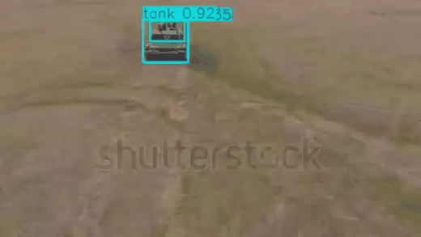
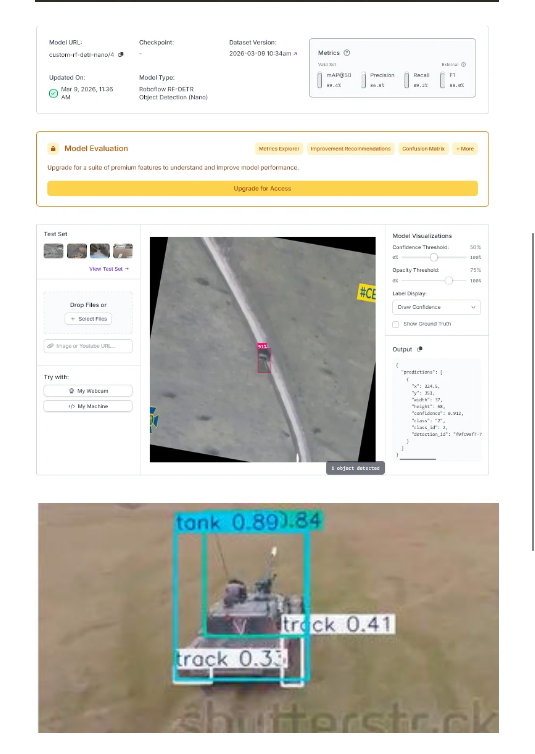
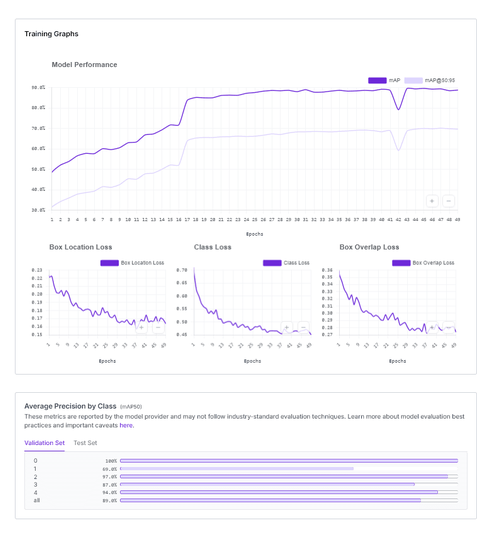

# Custom RF-DETR Nano Aerial Vehicle Detection (Trained & Validated on Roboflow)

[](LICENSE)
[]()
[]()
[]()
[]()

> Fine-tuned **RF-DETR Nano** (PyTorch-based) via Roboflow on a custom-annotated aerial dataset. Instead of identifying whole vehicles only, the model detects and distinguishes between various vehicle sub-components across 5 hierarchical classes, achieving **89.4% mAP@50** on the validation set.

---

## 📽️ Demo & Aerial Vehicle Detection

The model performing aerial vehicle detection and sub-component classification from a drone perspective:



> **Technical Benchmark Note:** Evaluated on real-world aerial test sample (licensed stock footage) to test scale invariance and low-contrast detection.

---

## 📊 Model Evaluation & Training Metrics

The model was trained and evaluated using custom aerial drone datasets with Roboflow data augmentations (scaling, rotational variance, and illumination shifts) to guarantee field robustness under dynamic flight conditions.

| Metric | Score | Detail |
|---|---|---|
| **mAP@50** | **89.4%** | Strong cross-validation across 50 epochs |
| **Precision** | **86.8%** | High certainty, minimal false alarms |
| **Recall** | **89.2%** | High target retention during fast maneuvers |
| **F1-Score** | **88.0%** | Balanced harmonic precision-recall mean |

### Class-by-Class Average Precision (mAP50)
* **Class 0:** 100% AP
* **Class 1:** 69.0% AP
* **Class 2:** 97.0% AP
* **Class 3:** 87.0% AP
* **Class 4:** 94.0% AP

### 1. Hierarchical Sub-Component Detection
The model simultaneously localizes multiple sub-parts of each vehicle across 5 annotated classes:



### 2. 50-Epoch Convergence Curves
Demonstrating stable loss reduction across Box Location, Classification, and Box Overlap losses:



---

## 🏗️ Model Training & Evaluation Pipeline

```
[ Custom Aerial Dataset ] ──(Annotated across 5 vehicle sub-component classes)
            │
            ▼
[ Roboflow Platform ] ─────(Data augmentation: scaling, rotation, brightness)
            │
            ▼
[ RF-DETR Nano (PyTorch) ] ──(50-epoch training with convergence monitoring)
            │
            ▼
[ Validation Metrics ] ─────(89.4% mAP@50 | 86.8% Precision | 89.2% Recall)
```

---

## ⚙️ Key Technical Challenges & Solutions

### 1. Granular Sub-Component Disambiguation
* **Problem:** Conventional single-box detectors center on the visual centroid of a vehicle, which frequently shifts when partially obscured or camouflaged.
* **Solution:** Structured a 5-class hierarchical annotation scheme separating distinct vehicle sub-components (hull, turret assembly, mobility system, etc.), enabling the model to maintain detection even under partial occlusion.

### 2. Robust Aerial Detection Under Scale Variance
* **Problem:** Aerial perspectives introduce extreme scale variance as altitude and distance change, causing significant AP degradation on smaller sub-components.
* **Solution:** Applied Roboflow augmentation pipelines (scaling, rotational variance, brightness and contrast shifts) to simulate diverse flight altitudes and lighting conditions. Achieved strong per-class AP across all 5 categories.

---

## 🛠️ Stack & Dependencies
* **Model:** RF-DETR Nano (PyTorch-based)
* **Training & Validation:** Roboflow Platform
* **Core Languages:** Python 3.10+
* **Vision:** OpenCV 4.8+
* **Dataset:** Custom-annotated aerial vehicle imagery (5 classes)

---

## 🚀 Quickstart & Reproduction

### 1. Clone Repo & Install Requirements
```bash
git clone https://github.com/amanullah7x/edge-vision-tracking-jetson.git
cd edge-vision-tracking-jetson
pip install -r requirements.txt
```

### 2. Run Inference Demo
```bash
python run_pipeline.py --max-frames 120
```
